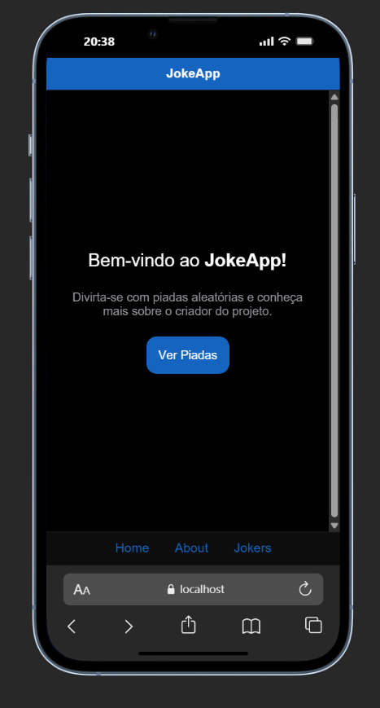
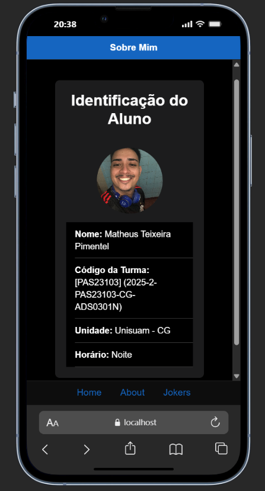
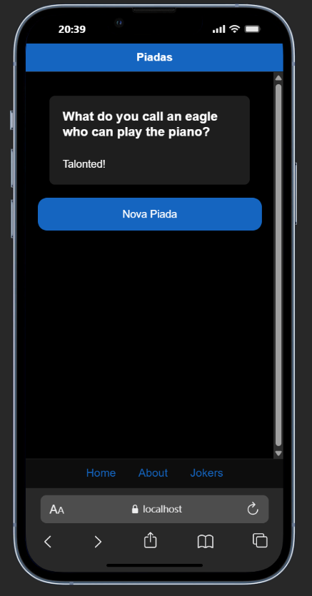

# Passo a Passo do Desenvolvimento do Aplicativo Ionic

## 1. Criação do Projeto
- Executei o comando para criar o projeto Ionic:
  ```bash
  ionic start jokeapp blank --type=angular
  ```
- Entrei na pasta do projeto:
  ```bash
  cd jokeapp
  ```

## 2. Estrutura de Páginas e Rotas
- Criei as páginas principais:
  - Home
  - About
  - Jokes
As rotas foram configuradas em `src/app/app.routes.ts`:
```typescript
import { NgModule } from '@angular/core';
import { RouterModule, Routes } from '@angular/router';
import { AboutPage } from './pages/about/about.page';
import { HomePage } from './pages/home/home.page';
import { JokesPage } from './pages/jokes/jokes.page';

export const routes: Routes = [
  { path: '', redirectTo: 'home', pathMatch: 'full' },
  { path: 'home', component: HomePage },
  { path: 'about', component: AboutPage },
  { path: 'jokes', component: JokesPage },
];

@NgModule({
  imports: [RouterModule.forRoot(routes)],
  exports: [RouterModule],
})
export class AppRoutingModule {}
```
- O roteamento foi ativado no `main.ts`:
  ```typescript
  bootstrapApplication(AppComponent, {
    providers: [
      provideRouter(routes),
      provideIonicRouter(),
      provideAnimations(),
      importProvidersFrom(IonicModule.forRoot()),
    ],
  });
  ```

## 3. Card de Identificação
- Adicionei um card de identificação na página `about.page.html`:
  ```html
  <ion-card>
    <ion-card-header>
      <ion-card-title>Identificação do Aluno</ion-card-title>
    </ion-card-header>
    <ion-card-content>
      <ion-avatar style="margin-bottom: 16px;">
        
      </ion-avatar>
      <ion-list>
        <ion-item>
          <ion-label><strong>Nome:</strong> Matheus Teixeira</ion-label>
        </ion-item>
        <ion-item>
          <ion-label><strong>Código da Turma:</strong> 123456</ion-label>
        </ion-item>
        <ion-item>
          <ion-label><strong>Unidade:</strong> Unisuam</ion-label>
        </ion-item>
        <ion-item>
          <ion-label><strong>Horário:</strong> Noite</ion-label>
        </ion-item>
      </ion-list>
    </ion-card-content>
  </ion-card>
  ```

## 4. Consumo de API
Criei o serviço `joke.service.ts` para consumir a API de piadas:
```typescript
import { Injectable } from '@angular/core';

@Injectable({ providedIn: 'root' })
export class JokeService {
  private API_URL = 'https://official-joke-api.appspot.com/random_joke';

  async getRandomJoke(): Promise<any> {
    const res = await fetch(this.API_URL);
    return await res.json();
  }
}
```
- Implementei o consumo da API na página `jokes.page.ts`:
  ```typescript
  import { Component } from '@angular/core';
  import { JokeService } from '../../services/joke.service';

  @Component({
    selector: 'app-jokes',
    templateUrl: './jokes.page.html',
    styleUrls: ['./jokes.page.scss']
  })
  export class JokesPage {
    joke: string = '';
    constructor(private jokeService: JokeService) {}
    getJoke() {
      this.jokeService.getRandomJoke().subscribe(data => {
        this.joke = data.value;
      });
    }
  }
  ```

## 5. Navegação
- Os botões de navegação estão presentes no rodapé de todas as páginas, permitindo ir para Home, About e Jokes.

## 6. Prints das Telas
- 
- 
- 

## 7. Publicação no GitHub
- Subi o projeto para o GitHub:
  ```bash
  git init
  git remote add origin https://github.com/seuusuario/jokeapp.git
  git add .
  git commit -m "Projeto Ionic JokeApp"
  git push -u origin master
  ```

---

